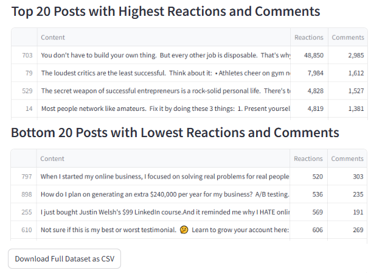

# LinkedIn Scraper App

This LinkedIn Scraper App is built with Streamlit and Selenium. It allows users to scrape LinkedIn posts data, such as the content, reaction count, and comment count, from a public LinkedIn profile using a `cookies.txt` file for authentication. The app provides the top 20 and bottom 20 posts based on reactions and comments.

The UI


The Output



## Table of Contents

1. [Requirements](#requirements)
2. [Installation](#installation)
3. [Getting the `cookies.txt` File](#getting-the-cookiestxt-file)
4. [Running the App](#running-the-app)
5. [Usage](#usage)
6. [Notes](#notes)

---

### Requirements

To run this app, you will need the following:

1. **Python 3.7+**
2. **Streamlit**: For the web interface.
3. **Selenium**: For web scraping LinkedIn posts.
4. **pandas**: To handle and display the scraped data in tables.
5. **BeautifulSoup**: For parsing HTML content.

### Installation

1. **Clone the Repository**  
   Clone this repository to your local machine.

   ⚠️ **If you don't have Python in your PC**, go to [Replit](https://replit.com/) to run the app without installing Python. Any other cloud that supports Selenium can work.

2. **Install the Required Packages**  
   Run the following command to install all necessary packages:

   ```bash
   pip install streamlit selenium pandas beautifulsoup4
   ```
   **Note**: No need to install the packages if you use Replit. 

3. **Download Chrome WebDriver**  
   Since Selenium requires Chrome WebDriver, make sure to download the version matching your installed Chrome browser version. [Download ChromeDriver](https://developer.chrome.com/docs/chromedriver/downloads).

   After downloading, place the ChromeDriver executable in a directory in your system PATH or specify its path in your script.

   Check the version: chrome://version

### Getting the `cookies.txt` File

To scrape LinkedIn, you need to authenticate by providing a `cookies.txt` file for your LinkedIn session. This can be obtained using a browser extension:

1. Install the [Get cookies.txt](https://chromewebstore.google.com/detail/get-cookiestxt-clean/ahmnmhfbokciafffnknlekllgcnafnie) extension for Chrome.
2. Log in to LinkedIn on your browser.
3. Use the extension to export cookies for LinkedIn.

### Running the App

1. **Launch the Streamlit App**  
   In your terminal, navigate to the project directory and run:

   ```bash
   python -m streamlit run app.py
   ```

2. **Access the App**  
   Once the app is running, it will open in your default browser, typically at `http://localhost:8501`, or in the web window on Replit.

### Usage

1. **Upload Cookies**  
   Upload the cookies file to allow the app to authenticate your LinkedIn session.

2. **Enter Profile URL**  
   In the app, enter the LinkedIn profile URL you wish to scrape (e.g., `https://www.linkedin.com/in/{user_id}/recent-activity/all/`).

3. **Specify Maximum Number of Posts**  
   Set the maximum number of posts to scrape (up to 100,000).

4. **Start Scraping**  
   Click on the "Start Scraping" button. The app will log in to LinkedIn, scroll through the specified profile, and scrape recent posts.

5. **Download Data**  
   Once the scrape is complete, you can download the dataset as a CSV file, which includes all scraped posts with their content, reaction counts, and comment counts.

### Notes

- **Selenium**: The app uses Selenium, which may not be supported for deployment on all platforms, including Streamlit’s cloud.
- **Privacy**: This app requires LinkedIn cookies for access, so ensure your cookies are securely stored and only accessible by you.
- **LinkedIn Restrictions**: LinkedIn’s terms prohibit scraping for unauthorized purposes. Ensure you follow all legal requirements when using this tool.
